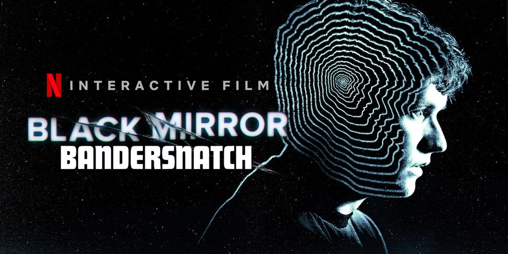

# PEC3: Visionando el futuro con las gafas de Manovich 

**Autor:** Andrés Ibáñez

**Fecha:** 03/05/2026

*Imagen: Magnific. (https://www.magnific.com/es)*

## Planteamiento

En "El software toma el mando", Manovich analiza cómo el software ha transformado la cultura digital. Entre sus ideas destaca la hibridación, que se podría definir como la mezcla de distintos medios que acaba generando algo completamente nuevo y diferente, algo que no existía antes.
 
Para entender bien este concepto hay que diferenciarlo de la multimedia. En la multimedia los medios conviven pero cada uno mantiene su propio lenguaje:
 
> "cada elemento de un mensaje multimedia se abre en su propio visor"
>
> *Manovich, L. (2013). El software toma el mando. UOC.*
 
En la hibridación en cambio:
 
> "se fusionan para ofrecer una experiencia nueva y coherente, que es distinto a experimentar los elementos uno por uno"
>
> *Manovich, L. (2013). El software toma el mando. UOC.*
 
Con esta idea, analizamos estos dos casos de hibridación: **Bandersnatch** y **Reactable**.

## Re-descubriendo la hibridacion: Bandersnatch

*Imagen: Game Rant. (https://gamerant.com)*

Bandersnatch, una película interactiva que pertenece a la serie Black Mirror y que podía verse desde Netflix. Lo que la diferencia de una película normal es que aquí el espectador participa durante el transcurso de ella tomando decisiones que cambian el rumbo de la historia, por lo que cada persona puede ver una historia y final diferente.

En la película el espectador decide qué debe hacer o pasar en determinados momentos: qué música escucha, qué decisiones toma, qué camino debe seguir. Algunas elecciones son triviales pero otras cambian la historia. Para hacer posible esta película se estima que se grabaron más de 5 horas de material y muchos finales posibles, lo que hace que cada vez que se vea sea una experiencia completamente diferente.

Esta película supuso un antes y un después en la forma de consumir contenido audiovisual. Cuando se estrenó generó mucha expectación sobre todo porque Netflix no confirmó que iba a ser interactiva hasta un día antes de publicarla. Por primera vez quien la veía no iba a ser un simple observador sino que se convertiría en parte de la historia, algo que hasta entonces no se había visto en una plataforma de streaming.

Con las gafas de Manovich, Bandersnatch es un ejemplo claro de hibridación. Combina el lenguaje del cine con la interactividad para crear algo completamente nuevo: no es una película porque el espectador decide qué ocurre, pero tampoco es solo algo interactivo porque sin la narrativa cinematográfica no tendría sentido. Se fusionan los dos para crear algo que antes no existía. Volviendo a hacer referencia a Manovich, *"el resultado de la hibridación no es tan solo la suma mecánica de las partes existentes previamente, sino una nueva «especie»" (Manovich, 2013)* y eso es exactamente Bandersnatch.

Repasando los principios del software de Manovich, podemos ver la variabilidad de forma clara ya que cada espectador vive una historia diferente según las decisiones que toma, no existe una única versión. La modularidad se ve en cómo cada escena funciona como un módulo independiente que se conecta con otros según la elección o decisión elegida esto permite construir narrativas distintas a partir de los mismos bloques. Y la transcodificación se puede apreciar cuando la narrativa cinematográfica se convierte en datos que el software gestiona para ofrecer una u otra rama de la historia en tiempo real.

Los medios que se hibridan en Bandersnatch son:
- **Cine**: narrativa audiovisual con personajes y una historia.
- **Interactividad**: el espectador toma decisiones que determinan el desarrollo y el final de la historia, algo posible gracias al software de la plataforma en este caso Netflix.

## Re-descubriendo la hibridacion: Caso 2

Lorem ipsum dolor sit amet, consectetur adipiscing elit, sed do eiusmod tempor incididunt ut labore et dolore magna aliqua. Ut enim ad minim veniam, quis nostrud exercitation ullamco laboris nisi ut aliquip ex ea commodo consequat. Duis aute irure dolor in reprehenderit in voluptate velit esse cillum dolore eu fugiat nulla pariatur. Excepteur sint occaecat cupidatat non proident, sunt in culpa qui officia deserunt mollit anim id est laborum.

### Referencias y Bibliografía

* Manovich, Lev. (2013). **El Software toma el mando**. Barcelona: Editorial UOC. 

----

Licencia: Material Creative Commons desarrollado bajo licencia CC BY-SA 4.0.
