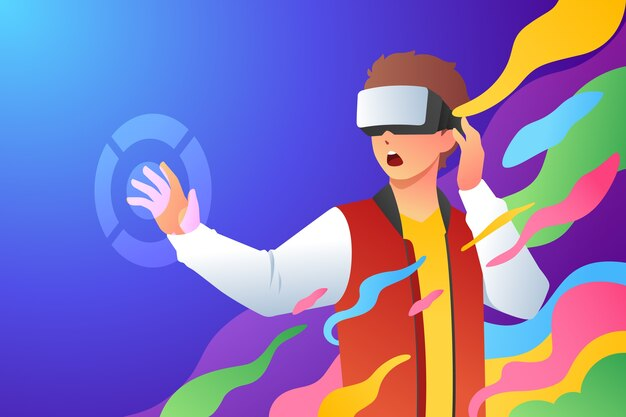

# PEC3: Visionando el futuro con las gafas de Manovich 

**Autor:** Andrés Ibáñez

**Fecha:** 29/04/2026

*Imagen: Magnific. (https://www.magnific.com/es)*

## Planteamiento

En "El software toma el mando", Manovich analiza cómo el software ha transformado la cultura digital. Entre sus ideas destaca la hibridación, que se podría definir como la mezcla de distintos medios que acaba generando algo completamente nuevo y diferente, algo que no existía antes.
 
Para entender bien este concepto hay que diferenciarlo de la multimedia. En la multimedia los medios conviven pero cada uno mantiene su propio lenguaje:
 
> "cada elemento de un mensaje multimedia se abre en su propio visor"
>
> *Manovich, L. (2013). El software toma el mando. UOC.*
 
En la hibridación en cambio:
 
> "se fusionan para ofrecer una experiencia nueva y coherente, que es distinto a experimentar los elementos uno por uno"
>
> *Manovich, L. (2013). El software toma el mando. UOC.*
 
Con esta idea, analizamos estos dos casos de hibridación: **Bandersnatch** y **Reactable**.

## Re-descubriendo la hibridacion: Bandersnatch

Lorem ipsum dolor sit amet, consectetur adipiscing elit, sed do eiusmod tempor incididunt ut labore et dolore magna aliqua. Ut enim ad minim veniam, quis nostrud exercitation ullamco laboris nisi ut aliquip ex ea commodo consequat. Duis aute irure dolor in reprehenderit in voluptate velit esse cillum dolore eu fugiat nulla pariatur. Excepteur sint occaecat cupidatat non proident, sunt in culpa qui officia deserunt mollit anim id est laborum.

## Re-descubriendo la hibridacion: Caso 2

Lorem ipsum dolor sit amet, consectetur adipiscing elit, sed do eiusmod tempor incididunt ut labore et dolore magna aliqua. Ut enim ad minim veniam, quis nostrud exercitation ullamco laboris nisi ut aliquip ex ea commodo consequat. Duis aute irure dolor in reprehenderit in voluptate velit esse cillum dolore eu fugiat nulla pariatur. Excepteur sint occaecat cupidatat non proident, sunt in culpa qui officia deserunt mollit anim id est laborum.

### Referencias y Bibliografía

* Manovich, Lev. (2013). **El Software toma el mando**. Barcelona: Editorial UOC. 

----

Licencia: Material Creative Commons desarrollado bajo licencia CC BY-SA 4.0.
